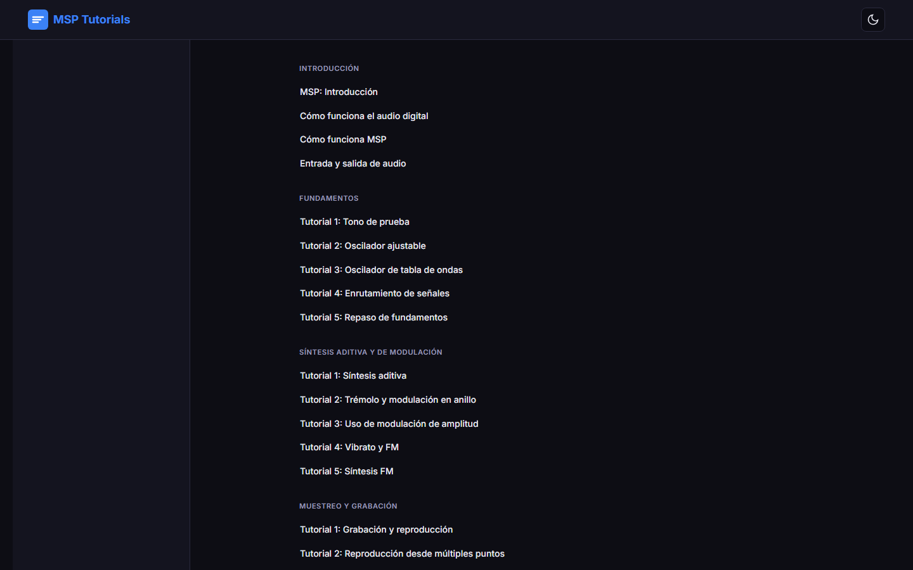

# MSP Tutoriales ES


> Tutoriales de MSP de [Cycling '74](https://cycling74.com) traducidos al español y organizados como una experiencia web moderna de aprendizaje.



MSP (Max Signal Processing) es el motor de procesamiento de audio en tiempo real de Max/MSP. Este proyecto reúne los **63 tutoriales oficiales** en una aplicación web estática construida con [Astro](https://astro.build), manteniendo el rigor técnico del original: los nombres de objetos y la sintaxis de Max (`cycle~`, `dac~`, `buffer~`, `tapin~`, etc.) se conservan sin traducir, tal como exige la terminología de Max/MSP.

## Características

- 📚 **63 capítulos** traducidos al español
- 🗂️ **14 secciones** temáticas (introducción, síntesis, muestreo, filtros, MIDI, compresión, etc.)
- 🧭 Navegación lateral con todas las secciones y capítulos
- 🔍 Búsqueda de texto completo sobre el contenido
- 🌙/☀️ Modo claro y oscuro
- 💾 Acceso a los patchers `.maxpat` de cada capítulo

## Decisiones técnicas

### ¿Por qué Astro?

El proyecto es contenido intensivo: 63 documentos largos que deben cargar rápido. Astro genera HTML estático por defecto, lo que da una puntuación excelente en rendimiento sin JavaScript en el hilo principal. Además, su *content layer* integra nativamente los archivos Markdown/MDX como primera clase.

### ¿Por qué MDX?

Los tutoriales alternan párrafos, tablas, bloques de código de Max y notas. MDX permite incrustar componentes de Astro dentro del contenido cuando sea necesario, sin perder la simplicidad de escribir en Markdown.

### Content Collections

Todo el contenido está tipado y validado con **Astro Content Collections** (`src/content.config.ts`): cada archivo debe declarar `title`, `description`, `section`, `order`, `slug` y `originalUrl` antes de poder construirse. Esto detecta errores de estructura en el build y habilita autocompletado en el editor.

### Búsqueda

La página de búsqueda busca sobre un índice generado en el build. Se diseñó como una ruta estática (`/buscar`) que consulta el contenido completo para no cargar JS pesado en cada visita.

### Patchers

Cada capítulo referencia su patcher de ejemplo original (`patcherUrl`), enlazando al recurso oficial de Cycling '74 en lugar de redistribuir archivos de terceros.

### Traducción y criterios editoriales

Los objetos y la sintaxis de Max/MSP **no se traducen** (son un lenguaje de programación). Sí se traducen las explicaciones, gráficos conceptuales y términos de audio cuando tienen un equivalente natural en español. El objetivo es que un lector hispanohablante entienda los conceptos y pueda abrir los patchers originales sin fricción.

## Desarrollo asistido por IA

Este proyecto se desarrolló con agentes de código (OpenCode) siguiendo instrucciones específicas (AGENTS.md y CLAUDE.md) que mantienen consistencia en la estructura de contenido, las decisiones técnicas y las convenciones de escritura. Se trata de una manera de documentar y acelerar la construcción del sitio manteniendo el control humano de las decisiones del proyecto.

## Cómo ejecutarlo localmente

```bash
npm install
npm run dev        # Servidor de desarrollo en localhost:4321
```

Para generar el sitio de producción:

```bash
npm run build      # Genera ./dist/
npm run preview    # Previsualiza el build
```

## Estructura del proyecto

```text
/
├── public/
│   ├── images/                  # Imágenes y capturas
│   └── patchers/                # Patchers .maxpat descargables
├── src/
│   ├── components/              # Sidebar y componentes de UI
│   ├── content/
│   │   └── tutoriales/          # 63 archivos .mdx (el contenido)
│   ├── layouts/                 # Layout principal
│   └── pages/
│       ├── index.astro          # Portada
│       ├── buscar.astro         # Página de búsqueda
│       ├── 404.astro
│       └── tutoriales/          # Secciones y rutas de cada capítulo
├── src/content.config.ts        # Tipado y validación del contenido
├── astro.config.mjs
└── package.json
```

## Estado del proyecto

- ✅ Traducción completa de los 63 capítulos
- ✅ Sitio estático construido y verificado (80 páginas)
- ✅ CI: build automático con GitHub Actions (npm ci + astro build)
- 🚧 Deploy pendiente (Vercel / GitHub Pages)
- 🚧 Descarga local de imágenes y patchers en curso

## Roadmap

El roadmap se gestiona como [Issues del repositorio](https://github.com/fedecruz1981/msp-tutorials-es/issues). Actualmente:

- [ ] Publicar el sitio en línea
- [ ] Revisar terminología de síntesis
- [ ] Mejorar la búsqueda
- [x] Automatizar la comprobación del build (CI)
- [ ] Mejorar la accesibilidad y la navegación móvil

## Créditos y atribución

El contenido original pertenece a **Cycling '74** y está sujeto a sus términos y condiciones. Este proyecto es una **traducción independiente con fines educativos**: no redistribuye los archivos `.maxpat` originales ni el material audiovisual; enlaza a ellos desde cada capítulo.

- Tutoriales originales: [docs.cycling74.com/learn/series/msp-tutorials](https://docs.cycling74.com/learn/series/msp-tutorials/)
- Max/MSP: [cycling74.com](https://cycling74.com)

## Licencia

Los derechos sobre el contenido original pertenecen a sus autores (Cycling '74). El código de este sitio (estructura, componentes y configuración de Astro) es de uso libre con fines educativos. Antes de distribuir el contenido traducido, revisa los términos de Cycling '74.

## Sitio publicado

- **Producción:** https://fedecruz1981.github.io/msp-tutorials-es/
- **Rama servida:** `gh-pages` (se construye desde `dist/` y se publica con `deploy-ghpages.js`).
- `main` contiene el sitio fuente; `npm run build` compila y ejecuta `scripts/rebase-dist.mjs`, que antepone el base path a las rutas relativas en el HTML generado.
